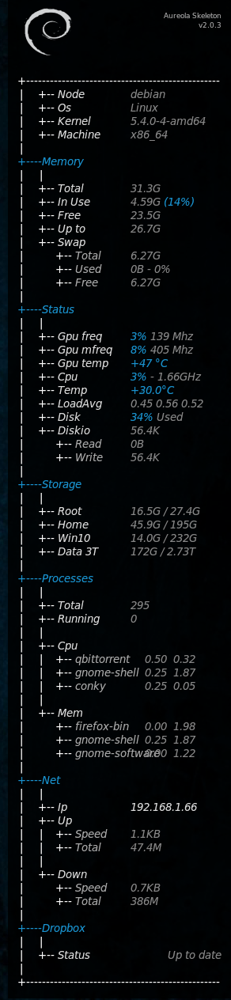

# Dotfiles - secondsquadron

These are my current dotfiles. I use them on **Debian** _testing_.
There are (and will be) other files as well, some system configuration file, manually made desktop files, etc. which are enough important to backup and share.

## General shell environment tools
### vim
I use **vim-plug** to maintain vim plugins. Pretty convenient!\
**https://github.com/junegunn/vim-plug**

### bash
As a bash user I find **bash-it** the best way to get nice themes, git integration and other functionality.
I just use plain powerline theme.\
**https://github.com/Bash-it/bash-it**

### tmux
Screen multiplexer is a must for me. I use **tmux**. It has some neat plugins.\
**https://github.com/tmux/tmux**

### powerline
I have to mention **powerline** which makes both bash, tmux and vim a bit prettier and more productive.\
**https://github.com/powerline/powerline**

## Shell tools just to mention
### fzf
Fuzzy finder, really fast ! Great to use for searching in bash history. Possible alternative is [fzy](https://github.com/jhawthorn/fzy).\
**https://github.com/junegunn/fzf**

### ripgrep (rg) and silver_search (ag)
Both are great but bit different grep replacements.
**https://github.com/BurntSushi/ripgrep**
**https://github.com/ggreer/the_silver_searcher**

### facebook path picker
Interactive file selector from command output. Nice and handy.
**https://github.com/facebook/PathPicker**

### forgit
Forgit is a nice interactive selector for different git operations.
**https://github.com/wfxr/forgit**

### tig
Tig is a convenient text interface to git.
**https://github.com/jonas/tig**

## Development tools
### gdb
Once there was a nice debugger called SoftICE which I really liked. This init file tries to bring back it's interface. Also, set the disassembly style to Intel. \
**https://github.com/gdbinit/Gdbinit**

### clang-format
Clang is a great tool to style code. Currently I just use the LLVM style with 4 IndentWidth.
**https://clang.llvm.org/docs/ClangFormat.html**

## Other tools

### VcXsrv
An X server is needed for Windows if we want to use any graphical software under WSL. I recommend VcXsrv as it is still maintained.
You'll need a custom launch config to be able to use it with WSL.
**https://sourceforge.net/projects/vcxsrv/**

###  Conky
I am a big fan of **conky**. I use a customized theme from **Aureola**.
Added nvidia related nodes.\
**https://github.com/brndnmtthws/conky** \
**https://github.com/erikdubois/Aureola** \

